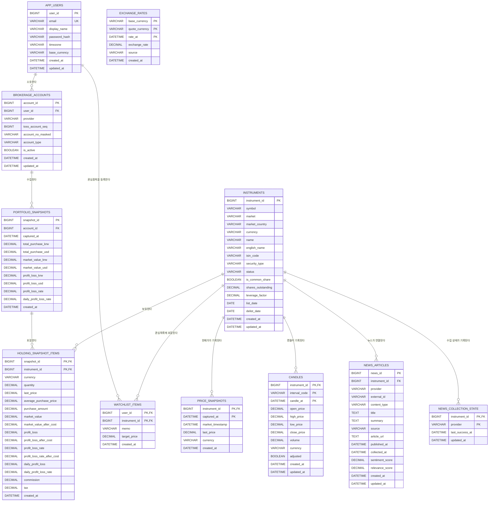

# TOSS_MANAGER

토스증권 Open API 1.2.14, Streamlit, TiDB를 이용한 개인 포트폴리오 분석의 조회 전용 스타터입니다.

이 앱은 분석용 예제이며 투자 조언이나 수익을 보장하지 않습니다.

## 실행 준비

Python 3.12 이상과 TiDB(MySQL 호환)가 필요합니다. `.env.example`을 참고해 `.env`에
TiDB 접속 정보를 설정하세요. 전체 `TIDB_DATABASE_URL`을 지정하거나 `DB_HOST`,
`DB_PORT`, `DB_USERNAME`, `DB_PASSWORD`, `DB_DATABASE`를 각각 지정할 수 있습니다.
두 방식이 모두 있으면 `TIDB_DATABASE_URL`이 우선합니다.

뉴스 신호는 선택 기능입니다. 한국 뉴스에는 `NAVER_NEWS_CLIENT_ID`,
`NAVER_NEWS_CLIENT_SECRET`, `OPENDART_API_KEY`를, 미국 뉴스에는
`ALPHA_VANTAGE_API_KEY`를 설정합니다. 아무 뉴스 키도 설정하지 않으면 기존 기술적
분석만 실행됩니다. 뉴스 키 역시 DB에 저장하지 않습니다.

```bash
uv sync
uv run streamlit run main.py
```

### 뉴스 API 설정

1. NAVER Cloud Platform의 `NAVER API HUB > Application`에서 애플리케이션을 만들고
   Search API의 뉴스 검색을 활성화합니다. 앱의 `인증 정보`에서 발급되는 Client ID와
   Client Secret을 `NAVER_NEWS_CLIENT_ID`, `NAVER_NEWS_CLIENT_SECRET`에 설정합니다.
   NCP 계정 관리의 공통 Access Key ID와 Secret Key를 입력하면 안 됩니다.
2. OpenDART에서 인증키를 발급받아 `OPENDART_API_KEY`를 설정합니다.
3. Alpha Vantage에서 API 키를 발급받아 `ALPHA_VANTAGE_API_KEY`를 설정합니다.
4. `NEWS_REFRESH_SECONDS`는 공급자별 재호출 간격이며 최소 30초입니다. 화면 fragment는
   60초마다 실행되므로 기본값 60을 권장합니다.

언론사 본문 HTML은 수집하지 않습니다. 공식 API가 반환한 제목, 요약, 출처, 원문 링크,
발행 시각과 공급자 심리 값만 저장합니다.

앱 시작 시 TiDB 연결을 확인하고 아래 ER 다이어그램의 테이블을 자동 생성합니다.
이미 같은 이름의 테이블이 다른 구조로 존재하면 데이터를 임의 변경하지 않고 오류를 표시합니다.

## 프로젝트 구조

```text
app.py                         # 앱 시작, DB 연결, 화면 조립
toss_manager/
├── client.py                  # 토스증권 Open API 클라이언트
├── config.py                  # 환경변수와 TiDB 연결 설정
├── database.py                # TiDB 스키마 생성과 검증
├── repository.py              # 사용자, 계좌, 종목 upsert
├── transform.py               # API 응답을 DataFrame으로 변환
├── news/
│   ├── providers.py            # 네이버·OpenDART·Alpha Vantage 클라이언트
│   ├── repository.py           # 뉴스 중복 upsert와 최신 뉴스 조회
│   └── service.py              # 공급자 갱신과 주기별 뉴스 심리 계산
└── ui/
    ├── connect.py             # API 키 연결 화면
    ├── sidebar.py             # 계좌 선택과 보유 종목 이동
    ├── market.py              # 시장 순위, 종목 상세, 캔들 차트
    ├── common.py              # 통화 표시와 캔들 집계
    └── styles.py              # Streamlit 공통 스타일
```

토스 API 연결이 성공하면 입력한 이메일을 기준으로 `app_users`를 생성하거나 갱신하고,
조회 가능한 계좌를 `brokerage_accounts`에 저장합니다. 계좌번호는 끝 4자리만 남긴
마스킹 값으로 저장하며 Client ID와 Client Secret은 데이터베이스에 저장하지 않습니다.
선택한 계좌의 보유 종목은 조회할 때마다 `instruments`에 upsert됩니다.
종목 검색창은 티커뿐 아니라 `instruments.name`과 `english_name`도 검색합니다. 토스 Open
API는 회사명 검색 엔드포인트를 제공하지 않으므로, 처음 발견하는 종목은 티커로 한 번
조회해야 하며 이후부터 저장된 한글·영문 종목명으로 검색할 수 있습니다. 이름이 비슷한
종목이 여러 개면 시장이 일치하는 후보를 티커와 함께 선택 목록으로 표시합니다.

Porto 회원가입에는 아이디로 사용할 이메일, 비밀번호, 토스 Open API Client ID와
Client Secret이 필요합니다. API로 실제 계좌가 확인된 경우에만 가입되며, 비밀번호는
scrypt 해시만 저장되고 API 키는 DB에 저장되지 않습니다. 일반 로그인에서는 마지막으로 저장된 포트폴리오만
조회하고, Client ID와 Client Secret을 추가 입력한 세션에서만 토스 실시간 API를
사용합니다. 실시간 보유 내역은 계좌별로 최대 1분 간격으로 스냅샷에 저장됩니다.
종목 차트를 조회하면 토스 API가 반환한 공식 1분봉 또는 일봉을 `candles`에 upsert합니다.
화면에서 계산한 5분·10분·주·월·년 집계봉은 중복 저장하지 않습니다. 캔들 저장에
실패하더라도 API 조회가 성공했다면 최신 차트는 계속 표시됩니다.

`toss_manager/analysis`는 UI와 분리된 Porto 매니저 계산 패키지입니다. 현재 차트에
표시된 1분·5분·10분·일·주·월·년봉에서 EMA, MACD, RSI, 거래량, 볼린저 밴드와 ATR을
계산하고 규칙 기반 100점 점수 및 과거 동일·유사 신호의 다음 봉 종가 방향 통계를
제공합니다. 분석 결과는 투자 권유가 아닌 과거 패턴 참고 정보입니다.
종목 상세에 진입하면 토스 캔들 API의 `nextBefore` 페이지네이션으로 최근 5년 일봉을
수집하고 `candles` 테이블에 upsert합니다.
일봉·주봉·월봉·연봉 차트를 열 때도 같은 5년 일봉을 수집하므로 매니저 분석 버튼을
별도로 누르지 않아도 장기 데이터가 저장됩니다. 분봉 분석은 최소 분석 표본을 위해
1분봉은 200개, 5분봉은 원본 1분봉 1,000개, 10분봉은 원본 1분봉 2,000개까지
페이지네이션하여 저장한 뒤 현재 선택 주기로 집계합니다.
최초 수집 이후에는 DB의 마지막 일봉 시각을 확인하고 최신 API 페이지부터 과거로
이동하다가 저장 경계와 겹치는 즉시 중단합니다. 마지막 일봉은 장중 정정 가능성을
고려해 다시 upsert하며, 차트와 분석은 동기화 후 DB의 누적 전체 이력을 사용합니다.

종목 상세에 진입하면 한국 종목은 네이버 뉴스와 OpenDART, 미국 종목은 Alpha Vantage를
조회합니다. 공급자별 마지막 성공 시각은 `news_collection_state`에 저장하며 기본 60초
이내에는 같은 종목을 다시 요청하지 않습니다. 종목 상세가 열려 있는 동안 뉴스 영역은
60초마다 자동 갱신됩니다. 새 기사와 공시는 `news_articles`에
`(provider, external_id, instrument_id)` 기준으로 upsert합니다. Porto 매니저는 현재
차트 주기에 맞는 시간 구간만 선택해 뉴스 심리와 신뢰도를 기술적 점수와 별도로
표시합니다. 뉴스 조회 실패는 차트와 기술적 분석을 중단시키지 않습니다.

뉴스 심리는 기사별 50점을 기준으로 실적, 계약, 수주, 승인, 증자, 소송, 리콜 등
이벤트의 강도에 따라 가감합니다. 이후 종목 직접 관련성, 기사 최신성, 출처 신뢰도로
가중평균하며 60점 이상은 긍정, 40점 이하는 부정, 그 사이는 중립으로 분류합니다.
신뢰도는 종목 관련성 40%, 기사 간 방향 일치도 30%, 반영 표본 20%, 공식 공시 10%로
계산합니다. 제목과 요약에서 해당 종목이 직접 확인되지 않는 간접 언급 기사는 제외하며,
팝업의 `뉴스 점수 산정 기준`에서 반영·제외 건수와 산식을 확인할 수 있습니다.

API 키 없이 Porto 계정으로만 로그인하면 최신 `portfolio_snapshots`와
`holding_snapshot_items`에서 보유 종목을 불러오고, 해당 종목의 `candles`를 사용해
오프라인 차트와 Porto 매니저 분석을 제공합니다. 서버에 뉴스 공급자 키가 설정되어
있으면 토스 API 연결과 무관하게 최신 뉴스도 갱신하며, 그렇지 않으면 저장된 뉴스 또는
기술적 분석만 사용합니다. 화면에는 마지막 저장 시각을 표시해 실시간 데이터와 구분합니다.

## ER 다이어그램

