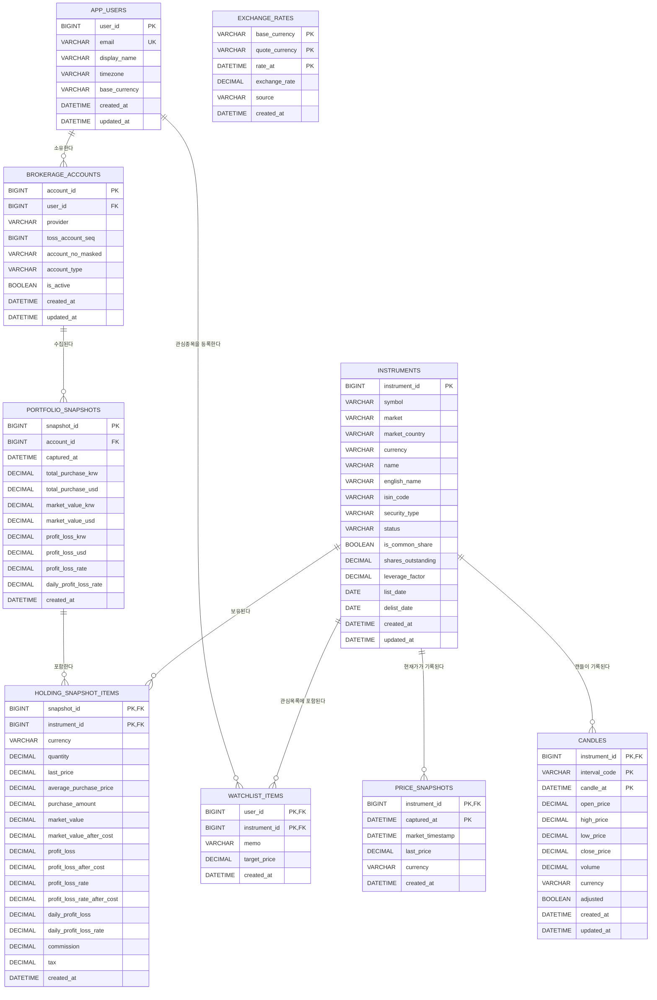

# TOSS_MANAGER

토스증권 Open API 1.2.14, Streamlit, TiDB를 이용한 개인 포트폴리오 분석의 조회 전용 스타터입니다.

이 앱은 분석용 예제이며 투자 조언이나 수익을 보장하지 않습니다.

# ER 다이어그램

```mermaid
erDiagram
    APP_USERS {
        BIGINT user_id PK
        VARCHAR email UK
        VARCHAR display_name
        VARCHAR timezone
        VARCHAR base_currency
        DATETIME created_at
        DATETIME updated_at
    }

    BROKERAGE_ACCOUNTS {
        BIGINT account_id PK
        BIGINT user_id FK
        VARCHAR provider
        BIGINT toss_account_seq
        VARCHAR account_no_masked
        VARCHAR account_type
        BOOLEAN is_active
        DATETIME created_at
        DATETIME updated_at
    }

    INSTRUMENTS {
        BIGINT instrument_id PK
        VARCHAR symbol
        VARCHAR market
        VARCHAR market_country
        VARCHAR currency
        VARCHAR name
        VARCHAR english_name
        VARCHAR isin_code
        VARCHAR security_type
        VARCHAR status
        BOOLEAN is_common_share
        DECIMAL shares_outstanding
        DECIMAL leverage_factor
        DATE list_date
        DATE delist_date
        DATETIME created_at
        DATETIME updated_at
    }

    PORTFOLIO_SNAPSHOTS {
        BIGINT snapshot_id PK
        BIGINT account_id FK
        DATETIME captured_at
        DECIMAL total_purchase_krw
        DECIMAL total_purchase_usd
        DECIMAL market_value_krw
        DECIMAL market_value_usd
        DECIMAL profit_loss_krw
        DECIMAL profit_loss_usd
        DECIMAL profit_loss_rate
        DECIMAL daily_profit_loss_rate
        DATETIME created_at
    }

    HOLDING_SNAPSHOT_ITEMS {
        BIGINT snapshot_id PK,FK
        BIGINT instrument_id PK,FK
        VARCHAR currency
        DECIMAL quantity
        DECIMAL last_price
        DECIMAL average_purchase_price
        DECIMAL purchase_amount
        DECIMAL market_value
        DECIMAL market_value_after_cost
        DECIMAL profit_loss
        DECIMAL profit_loss_after_cost
        DECIMAL profit_loss_rate
        DECIMAL profit_loss_rate_after_cost
        DECIMAL daily_profit_loss
        DECIMAL daily_profit_loss_rate
        DECIMAL commission
        DECIMAL tax
        DATETIME created_at
    }

    PRICE_SNAPSHOTS {
        BIGINT instrument_id PK,FK
        DATETIME captured_at PK
        DATETIME market_timestamp
        DECIMAL last_price
        VARCHAR currency
        DATETIME created_at
    }

    CANDLES {
        BIGINT instrument_id PK,FK
        VARCHAR interval_code PK
        DATETIME candle_at PK
        DECIMAL open_price
        DECIMAL high_price
        DECIMAL low_price
        DECIMAL close_price
        DECIMAL volume
        VARCHAR currency
        BOOLEAN adjusted
        DATETIME created_at
        DATETIME updated_at
    }

    EXCHANGE_RATES {
        VARCHAR base_currency PK
        VARCHAR quote_currency PK
        DATETIME rate_at PK
        DECIMAL exchange_rate
        VARCHAR source
        DATETIME created_at
    }

    WATCHLIST_ITEMS {
        BIGINT user_id PK,FK
        BIGINT instrument_id PK,FK
        VARCHAR memo
        DECIMAL target_price
        DATETIME created_at
    }

    APP_USERS ||--o{ BROKERAGE_ACCOUNTS : "소유한다"
    BROKERAGE_ACCOUNTS ||--o{ PORTFOLIO_SNAPSHOTS : "수집된다"
    PORTFOLIO_SNAPSHOTS ||--o{ HOLDING_SNAPSHOT_ITEMS : "포함한다"
    INSTRUMENTS ||--o{ HOLDING_SNAPSHOT_ITEMS : "보유된다"
    INSTRUMENTS ||--o{ PRICE_SNAPSHOTS : "현재가가 기록된다"
    INSTRUMENTS ||--o{ CANDLES : "캔들이 기록된다"
    APP_USERS ||--o{ WATCHLIST_ITEMS : "관심종목을 등록한다"
    INSTRUMENTS ||--o{ WATCHLIST_ITEMS : "관심목록에 포함된다"
```
