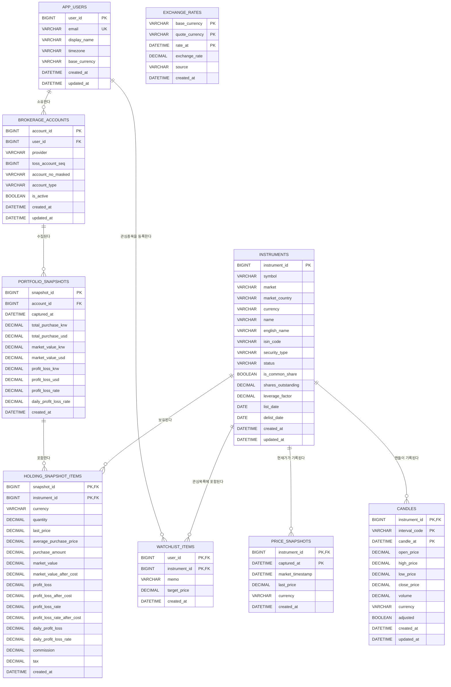

# TOSS_MANAGER

토스증권 Open API 1.2.14, Streamlit, TiDB를 이용한 개인 포트폴리오 분석의 조회 전용 스타터입니다.

이 앱은 분석용 예제이며 투자 조언이나 수익을 보장하지 않습니다.

## 실행 준비

Python 3.12 이상과 TiDB(MySQL 호환)가 필요합니다. `.env.example`을 참고해 `.env`에
TiDB 접속 정보를 설정하세요. 전체 `TIDB_DATABASE_URL`을 지정하거나 `DB_HOST`,
`DB_PORT`, `DB_USERNAME`, `DB_PASSWORD`, `DB_DATABASE`를 각각 지정할 수 있습니다.
두 방식이 모두 있으면 `TIDB_DATABASE_URL`이 우선합니다.

```bash
uv sync
uv run streamlit run main.py
```

앱 시작 시 TiDB 연결을 확인하고 아래 ER 다이어그램의 테이블을 자동 생성합니다.
이미 같은 이름의 테이블이 다른 구조로 존재하면 데이터를 임의 변경하지 않고 오류를 표시합니다.

## 프로젝트 구조

```text
app.py                         # 앱 시작, DB 연결, 화면 조립
toss_manager/
├── client.py                  # 토스증권 Open API 클라이언트
├── config.py                  # 환경변수와 TiDB 연결 설정
├── database.py                # TiDB 스키마 생성과 검증
├── repository.py              # 사용자, 계좌, 종목 upsert
├── transform.py               # API 응답을 DataFrame으로 변환
└── ui/
    ├── connect.py             # API 키 연결 화면
    ├── sidebar.py             # 계좌 선택과 보유 종목 이동
    ├── market.py              # 시장 순위, 종목 상세, 캔들 차트
    ├── common.py              # 통화 표시와 캔들 집계
    └── styles.py              # Streamlit 공통 스타일
```

토스 API 연결이 성공하면 입력한 이메일을 기준으로 `app_users`를 생성하거나 갱신하고,
조회 가능한 계좌를 `brokerage_accounts`에 저장합니다. 계좌번호는 끝 4자리만 남긴
마스킹 값으로 저장하며 Client ID와 Client Secret은 데이터베이스에 저장하지 않습니다.
선택한 계좌의 보유 종목은 조회할 때마다 `instruments`에 upsert됩니다.

Porto 회원가입에는 아이디로 사용할 이메일, 비밀번호, 토스 Open API Client ID와
Client Secret이 필요합니다. API로 실제 계좌가 확인된 경우에만 가입되며, 비밀번호는
scrypt 해시만 저장되고 API 키는 DB에 저장되지 않습니다. 일반 로그인에서는 마지막으로 저장된 포트폴리오만
조회하고, Client ID와 Client Secret을 추가 입력한 세션에서만 토스 실시간 API를
사용합니다. 실시간 보유 내역은 계좌별로 최대 1분 간격으로 스냅샷에 저장됩니다.
종목 차트를 조회하면 토스 API가 반환한 공식 1분봉 또는 일봉을 `candles`에 upsert합니다.
화면에서 계산한 5분·10분·주·월·년 집계봉은 중복 저장하지 않습니다. 캔들 저장에
실패하더라도 API 조회가 성공했다면 최신 차트는 계속 표시됩니다.

`toss_manager/analysis`는 UI와 분리된 Porto 매니저 계산 패키지입니다. 일봉에서
EMA, MACD, RSI, 거래량, 볼린저 밴드와 ATR을 계산하고 규칙 기반 100점 점수 및
과거 동일·유사 신호의 다음 일봉 통계를 제공합니다. 분석 결과는 투자 권유가 아닌
과거 패턴 참고 정보입니다.
Porto 매니저 분석을 실행하면 토스 캔들 API의 `nextBefore` 페이지네이션으로 최근
5년 일봉을 수집하고 `candles` 테이블에 upsert한 뒤 동일 데이터로 분석합니다.

## ER 다이어그램

